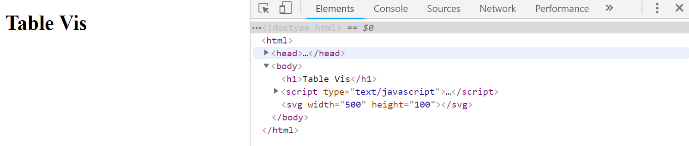
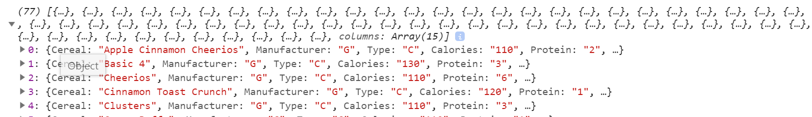
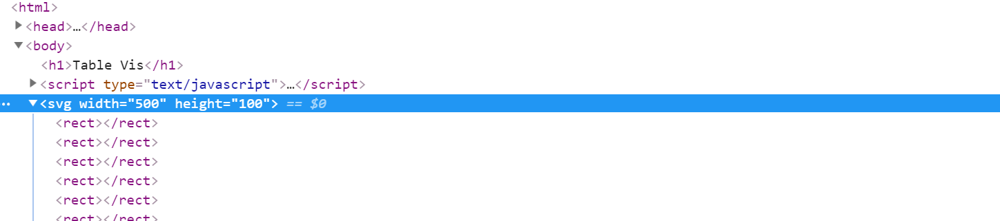
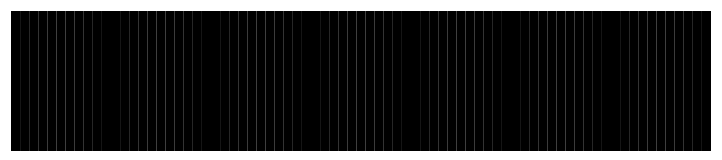
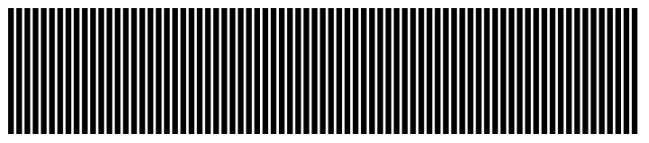
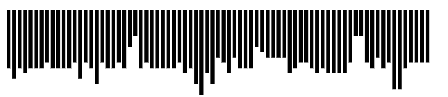
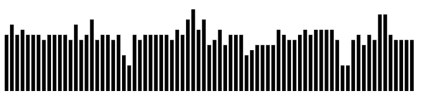
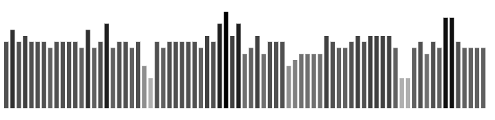
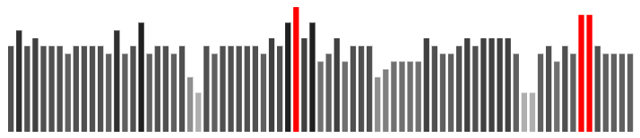
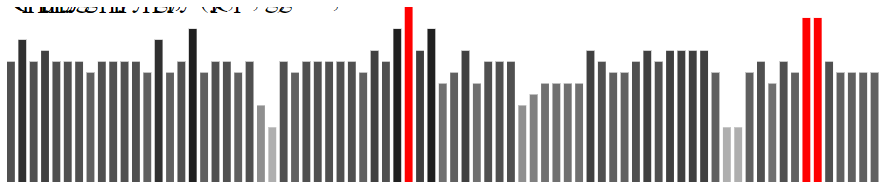

# HW2: Implement a Bar Chart
We are going to start with a gentle introduction to the fine art of bar chart construction. After going through the steps with a simple dataset of cereals, you are then going to apply the same steps to a new and somewhat more complex dataset. However, the overall process is the same for both datasets.

## Initial setup:
First, you need to get a local HTTP Server running on your machine. As we discussed in class, this will allow you to develop and test web programming assignments locally that require access to a data file on your system. The easiest option is through Python:

1. Download Python (Python 3.x)
    * https://www.python.org/
    * https://docs.python.org/3/library/http.server.html
1. In your command line tool (e.g., Terminal for MacOS, PowerShell for Windows) navigate to the directory in which you have cloned this repo.
1. Type the following command: `python -m http.server 8888`. This will start an HTTP server up and running on port 8888 that has access to all of the files in that directory (and subdirectories). You should see a message like the following:
    > Serving HTTP on 0.0.0.0 port 8888 (http://0.0.0.0:8888/)
1. In your web browser, type the following: `localhost:8888`. Your web browser will then make a connection to the HTTP server that you have up and running on port 8888. The browser will then be able to render HTML documents in that directory ("index.html" is loaded by default). More importantly, any JavaScript code that you include in the HTML files will be able to access data files in that directory (e.g., csv or json files).

You should see a mostly blank page with the words "Table Vis" at the top. If you open the `index.html` file, you should see that this represents everything that is currently present in the file. There is not much there, so far, is there? Let's change that.


```html
<!DOCTYPE html>
<html>
<head>
  <title>D3 Tabular Vis</title>
</head>
<body>
<h1>Table Vis</h1>
</body>
</html>
```

You now need to provide access to the d3.js library by importing the script into the `index.html` file. Within the `<head></head>` tags, just beneath the `<title></title>` tags, you should add a line with the following:

```diff
<head>
  <title>D3 Tabular Vis</title>
+  <script src="https://d3js.org/d3.v5.min.js"></script>
</head>
```
This will allow us to write code that utilizes d3 library. Keep in mind, you will need Internet access to link to the library this way. Let us also add a place to write some JavaScript that can be used to modify the Document Object Model (DOM). At the end of your `<body></body>` tags, add a new open and closing `<script></script>` tags to write some code into.

```diff
<h1>Table Vis</h1>
+ <script type="text/javascript">
+
+
+ </script>
</body>
</html>
```

Now that we can write JavaScript that modifies the DOM, let's put something in here for us to draw shapes using d3. All of the shapes that we'll be using in this tutorial are based on Scalable Vector Graphics ([SVGs](https://en.wikipedia.org/wiki/Scalable_Vector_Graphics)). We can use d3 to put new `<svg></svg>` tags into the body of the HTML document, and we can do that in a way that allows us to later modify that SVG later. We want our SVG space to be 500 pixels wide by 100 pixels high. At the top of the `<script></script>`, we are going to add a few lines to create our SVG space to those dimensions:

```diff
<script type="text/javascript">
+  var w = 500;
+  var h = 100;
+
+  var svg = d3.select("body").append("svg")
+    .attr("width", w)
+    .attr("height", h);
```

When you refresh the rendered HTML page, you will not really see much has changed. However, if you look into the developer tools for the page, you can see that the elements are different than before. We used d3 to select the `body` and append an `svg` to it, and now there is an `<svg width="500" height="100"></svg>` element appended *inside* the selected `body` tag. Always try to keep in mind that appending an element to a selection places it inside the selected element *at the end of all of the other elements inside that selection.* Now, we are ready to start importing data and drawing shapes based on them.



## Import and parse a .csv file:

Much of the data that we use when creating visualizations comes from comma-separated value (.csv) files. One is included in this repository for this tutorial: **a1-cereals.csv**. Each row in a csv is a data record, or datum. Each column is an attribute for that record. The first line in most csv files is the header, or list of column names, that are used for attributes for the records. The first few lines for the cereals file are given here:

| Cereal                  | Manufacturer | Type | Calories | Protein | Fat | Sodium | Fiber | Carbohydrates | Sugars | Shelf | Potassium | Vitamins | Weight | Cups |
|-------------------------|--------------|------|----------|---------|-----|--------|-------|---------------|--------|-------|-----------|----------|--------|------|
| Apple Cinnamon Cheerios | G            | C    | 110      | 2       | 2   | 180    | 1.5   | 10.5          | 10     | 1     | 70        | 25       | 1      | 0.75 |
| Basic 4                 | G            | C    | 130      | 3       | 2   | 210    | 2     | 18            | 8      | 3     | 100       | 25       | 1.33   | 0.75 |
| Cheerios                | G            | C    | 110      | 6       | 2   | 290    | 2     | 17            | 1      | 1     | 105       | 25       | 1      | 1.25 |

D3 provides handy functions for loading in csv, json, and many other file types. This function, `d3.csv()`, uses a structure called **promises**. This allows us to delay our code from continuing until after the csv file is completely loaded. If the file is **REALLY** big, we do not want to start drawing shapes or trying to access records before it's done being downloaded, right? So, after the call to `d3.csv()`, we have the chained call to `.then(function(data) {...})`. D3 passes the loaded data to the function inside the `.then()` call, which is accessible as a local variable called `data`. Almost all of our d3 code will be written inside the `then()` call.

```diff
  var svg = d3.select("body").append("svg")
    .attr("width", w)
    .attr("height", h);

+  d3.csv('a1-cereals.csv')
+    .then(function(data){
+      console.log(data);
+    })
</script>
```
Just to make sure everything looks okay, and do a quick sanity check, we output the raw data to the console (remember, we can always see console output in the developer tools). We should hopefully see an array of objects, which we can expand by clicking on the triangle on the left to view the contents. It should hopefully look something like what we are seeing below. This means that our data is loaded into the client, and we are ready to start creating SVG elements.



## Create an SVG element for each record:

We are creating a bar chart based on our data, which means that we are creating a single rectangular shape for each record. We are going to start off by selecting all of the `rect` SVGs that are inside our `<svg></svg>` element. Of course, there are not any there just yet, but we are going to create some! We are going to let d3 know that we want to use our `data` variable as the data to populate this visualization by chaining a call to `.data(data)` onto our selection. Then, we are going chain another call - this time to `.enter()`, which means that we want to do something with all of the items in our data that does not yet have a visual representation in the DOM. Since we're initially creating the visualization, that's everything! We end by chaining a call to `.append("rect")`, which will actually create a rectangle for each record.

```diff
console.log(data);

+ svg.selectAll("rect")
+   .data(data)
+   .enter()
+   .append("rect")
```

Now, we have not really specified much about the shape of these rectangles, but let's do a quick sanity check to make sure that they're actually being created. As always, let us take a quick check in the developer tools. We can see a nice list of rectangle elements are now inside our SVG elements.



Let's do a little thinking before we design the dimensions of our bars. Each shape has a consistent width, but the height is going to be based on the attributes of a record. We know that we have all of the width of the SVG to work with, or about 500 pixels. If we want to use all of the available space, then we want each bar to take up the same horizontal width - roughly the width divided by the number of records. For now, let's just let our bars be as tall as the available pixels.

```diff
svg.selectAll("rect")
  .data(data)
  .enter()
  .append("rect")
+  .attr("width", w / data.length)
+  .attr("height", h)
```


Well, now we are drawing...something, hopefully, but we wouldn't really call this a bar chart. We need to space these out, giving them a different position from left to right so that we can actually compare the bars to each other. Right now, they are all drawing on top of each other, so it looks like a single bar! We need to specify a value for x. However, we are going to base this on an attribute of the data item. In this case, the index `i`. That way, as we move from 0 (the starting index of the array of data records) to 76 (there are 77 items in the cereals file), we can increase the value of x.

```diff
  .attr("width", w / data.length)
  .attr("height", h)
+  .attr("x", function(d, i){
+    return w / data.length * i;
+  })
```



Well, we are now using all of the available width, but let's increase the spacing between the elements a little bit so that the individual bars are easier to make out. Start by adding a new variable called `cellpadding` beneath our current variables for w and h. We're going to want about two pixels between each bar. A little forethought goes a long way here - if we're going to be making a chart for 77 items, 500 pixels is probably wide enough to show a bar for each of them. If we were trying to fit 600 items into 500 pixels, we might need to increase the width of the svg or find another layout.

```diff
var w = 500;
var h = 100;
+ var cellpadding = 2;
```
...
```diff
.append("rect")
- .attr("width", w / data.length)
+ .attr("width", w / data.length - cellpadding)
.attr("height", h)
```



Now, what about the height? This is going to be based on the attributes directly in our data. Let's use Calories. We can inspect the data and see that the maximum value for the Calories attribute is 160 and the minimum is around 50. We have the full height of the svg in which to draw bars, so we want a bar for a record with 160 calories to be full height at 100 pixels. A record with 80 calories should be half that height, at around 50 pixels. So, our function for assigning the percentage of the total height that a bar is going to be is the value for the Calories attribute divided by the maximum Calories value. Since this is a ratio, we then multiply this by the total height to get the height of that bar in pixels.

```diff
.attr("height", h)
.attr("x", function(d, i){
  return w / data.length * i;
})
+ .attr("height", function(d){
+   return d.Calories / 160 * h;
+ })
```



Finally, we need to set the vertical position. Right now, everything is set at 0 by default. The coordinate system for SVGs in d3 puts (x=0, y=0) in the upper-left corner of the SVG. That is why all of our bars seem to be coming from the ceiling. If we want to have them come up from the bottom of the SVG, we need to make one more slight modification. We need to subtract the height of the bar from the height of the SVG element. This will put the upper left corner of each bar in the right place, and the *height* of the bar will draw *up* to the bottom of the SVG. It may seem a little confusing at first, but you get used to it.

```diff
.attr("height", function(d){
  return d.Calories / 160 * h;
})
+ .attr("y", function(d){
+   return h - +d.Calories / 160 * h;
+ })
```



## Redefine the spacing of elements to a predefined scale:

There was one aspect of the previous step that might have seemed particularly cumbersome. When we created the scaling for the height of our bars, we needed to inspect the data and determine what the maximum value was. Then, we hard-coded the ratio based on what we found. Do not get me wrong - it is always a good idea to inspect your data. But, what if we got an updated version of the file - do we really want to have to recode these values every time?

Luckily, d3 provides a useful shortcut through *custom scales.* Using the `d3.scaleLinear()` function, we can create a custom scale with a predefined **input domain** (the expected min and max of the data) and **output range** (the designed min and max of the pixel values that you want to use). In our case, we are going to create a custom `yScale` that maps the Calories **domain** to the vertical **range** of our bars. We use another d3 function, `d3.max()`, to calculate the maximum value of all of the Calories attributes when the file is loaded so that we no longer have to inspect the data. Now, when we calculate the height of our rectangles, we can instead just make a call to our `yScale()` and pass the Calories value to it. It will calculate the ratio for us and provide a height value.

```diff
+ var yScale = d3.scaleLinear()
+   .domain([0, d3.max(data, function(d){
+     return +d.Calories;
+   })])
+   .range([0, h]);

svg.selectAll("rect")
  .data(data)
  .enter()
  .append("rect")
```
...
```diff
.attr("height", function(d){
-  return d.Calories / 160 * h;
+  return yScale(d.Calories);
})
```

There is no alteration to the output, but this does help save us the headache of trying to manually construct the ratios based on the value. Do you think we could also use this for the y value of our rectangle? Of course we can!

```diff
.attr("height", function(d){
  return yScale(d.Calories);
})
.attr("y", function(d){
-  return h - +d.Calories / 160 * h;
+  return h-yScale(d.Calories);
})
```

Do you think we could also use a custom scale for the x axis? Try it out on your own!

## Add color and labels to SVG elements:

Up to this point, we have left our SVG `rect` elements with the default black fill. Right now, the only data encoding is the height of the bar. But, it is often useful to provide a secondary encoding to reinforce the point. Height is one channel, but as we are currently not using the color channel for any other types of data, we can provide a redundant encoding through color. The fill color of an SVG element is just another attribute: `fill="rgb(0,0,0)"` with an rgb, or red-green-blue value. This can be specified [several ways](https://www.w3.org/TR/SVGColor12/#sRGBcolor), but the most common is with three integer values from 0-255. If a fill is set to `rgb(0,0,0)`, then the fill color will be black. If the fill is `rgb(255,0,0)` then the fill color will be red. If it is `rgb(255,255,255)`, then the fill is white.

As before, let's create a custom scale for generating color values. As before, our domain is from 0 to the max of the dataset for the Calories attribute. There is a small difference, though, in that we are changing the range. We want the smaller values of Calories to be lighter in color, and the larger values to be darker. Therefore, our range is reversed in direction, going from 255 (lighter in shade) to 0 (darker in shade). As before, d3 can handle this conversion automatically, we just need to specify the range correctly in our new `colorScale` variable. Because we want these bars from light to dark, we want the red, green, and blue values to all increase at the same rate. So, in our attribute method chain for `fill`, we make a call to our `colorScale()` with the Calorie value for each record.

```diff
+ var colorScale = d3.scaleLinear()
+  .domain([0, d3.max(data, function(d){
+    return +d.Calories;
+  })])
+  .range([255, 0]);

svg.selectAll("rect")
  .data(data)
```
...
```diff
.attr("y", function(d){
  return h-yScale(d.Calories);
})
+ .attr("fill", function(d){
+   var f = colorScale(d.Calories);
+   return "rgb(" + f + "," + f + "," + f + ")";
+ });
```


Let's go ahead and make one more change to really make the highest values stand out. We are going to apply a highlight to the top 10% of possible values, which means that our custom range is returning a value less than or equal to 25.5. For these values, we want to put a conditional statement in that is giving a full, bright red fill.

```diff
.attr("fill", function(d){
  var f = colorScale(d.Calories);
+  if(f <= 25.5)
+    return "rgb(" + 255 + ",0,0)";
+  else
    return "rgb(" + f + "," + f + "," + f + ")";
});
```



But, we still cannot really tell what each of these bars are. Which of these bars is a high calorie cereal, and which are lower? We are missing text labels! We're going to need to start by applying a new selection to our SVG, but this time for text. Much like our previous selection, we are going to need to select all of the text elements in the SVG and append new text elements for each record in our dataset.

```diff
    else
      return "rgb(" + f + "," + f + "," + f + ")";
  });

+ svg.selectAll("text")
+   .data(data)
+   .enter()
+   .append("text")
+   .text(function(d){
+     return d.Cereal;
+   })
```



Hmmm. That's not quite it. We have our labels drawing text, but so far everything is still in the top left of the SVG. To line them up with our bars, we are going to need to *translate* them to the x and y coordinates of the bottom of the bar and also *rotate* them 90 degrees. With SVG elements, we can accomplish this with a single attr, *transform*, which lets us translate and rotate with a single call.

```diff
.text(function(d){
  return d.Cereal;
})
+ .attr("transform", function(d, i){
+   return "translate(" + w / data.length * i +
+     ","+h+")"+"rotate(90)"
+ })
```

Well, a quick refresh looks as though nothing is drawing. If we open the developer tools and look for the missing SVG text elements, we can see that they are present, but not visible. This is because the text labels are being drawn outside our SVG, which is only 500 pixels wide by 100 pixels tall. Since the labels are being drawn on the bottom of the rectangle elements, and the elements are at the bottom of the SVG, the text labels are not visible. We need to increase the size of our SVG and make some other small adjustments if we want to see the labels. First, let's expand our height and width.

```diff
- var w = 500;
+ var w = 1600;
- var h = 100;
+ var h = 500;
```

But, many of our calculations are based on scaling the height of the bars to the full height of the SVG. We will need to update the yScale so that we only devote half of the pixels to the bar, leaving the other half of the pixels for text labels. Similarly, we will have to update the y attribute for the text elements so that these elements are placed into the right location. Finally, we will have to update the transform attr for the text elements so that they are now placed beneath the new location of the bars and take advantage of all the new pixel space we have created for them!

```diff
var yScale = d3.scaleLinear()
  .domain([0, d3.max(data, function(d){
    return +d.Calories;
  })])
-  .range([0, h]);
+  .range([0, h/2]);
```
...
```diff
.attr("height", function(d){
  return yScale(d.Calories);
})
.attr("y", function(d){
-  return h-yScale(d.Calories);
+  return h/2-yScale(d.Calories);
})
```
```diff
.attr("transform", function(d, i){
  return "translate(" + w / data.length * i +
+    ","+h/2+")"+"rotate(90)"
-    ","+h+")"+"rotate(90)"
})
```


# Apply these steps to a new dataset:

Included in this repository is a second dataset, `pollution.csv`, that comes from the [Global Health Observatory data repository](http://apps.who.int/gho/data/view.main.SDGAIRBOD392v?lang=en). This data represents the ambient and household air pollution attributable death rate by country in 2016 (per 100,000 population, age-standardized).

For full credit on this assignment, you will need to apply the steps in this tutorial to the pollution dataset. This tutorial will get you most of the way there, but there is some additional work required. The pollution dataset is not so simple, and requires some transformation - you cannot just swap the file loaded into the `d3.csv()` function (though that is a definite first step). For full credit on this assignment, you will need to do the following:

1. [22.5%] Load the pollution.csv dataset. You will need to swap it for the previous cereals dataset in the file loader.
1. [22.5%] Create a bar for each record. There are far more records in this dataset than in the cereals: one for each combination of a country and a disease. You will need to manipulate the size of the SVG elements, custom scales, and bar sizes significantly to produce a legible image. The height of the bar should be based on the mortality attribute for both sexes.
1. [22.5%] Update the colors. Instead of ranging from white to black, update the bar color ranges so that they range from white to dark blue. As with the tutorial, highlight the top 20% of values (instead of the top 10%) in red.
1. [22.5%] Update the labels. The labels should consist of a combination of the country name and disease. You will likely have to manipulate the spacing of all elements in order to accommodate these components.
1. [10%] Nest and Rollup. Currently, each combination of country & disease is a separate record. However, using [nest and rollup](http://bl.ocks.org/phoebebright/raw/3176159/) we can transform the data to be a little more manageable. Using nest, we can specify a `key`, such as country, and manipulate the loaded data so that we get a separate array for each country. This will be an array containing a separate record for each disease. Then, using `rollup`, we can sum the values for each of the diseases so that we obtain a single mortality value for each country by sex. This reduces the number of bars that we are trying to create significantly. I recommend attempting this in a separate SVG rather than undoing all of your work for the previous steps. You should rollup the data so that each bar represents the total number of mortality cases for each country, for both sexes, across all diseases.

### Acknowledgements: 

This assignment was adapted from an assignment designed by [Dr. Alex Godwin](https://www.jagodwin.com).